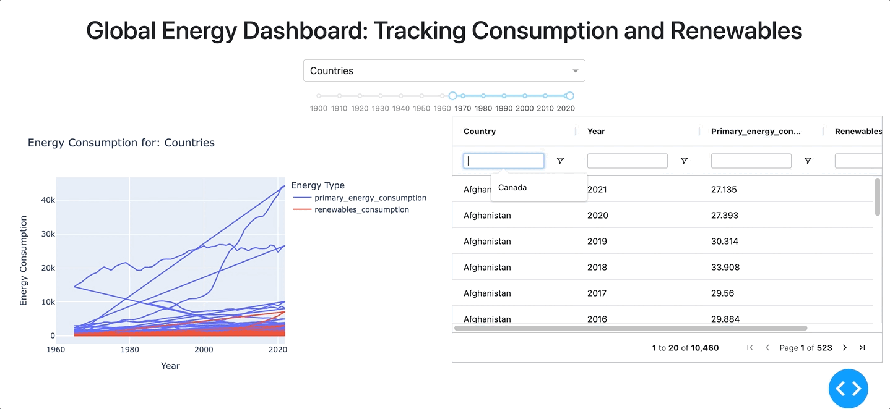
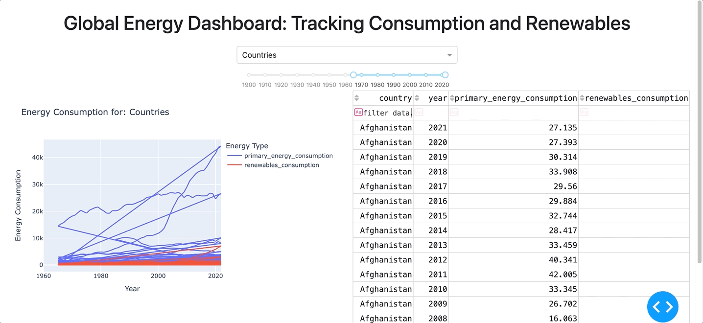

# dash-ag-grid-app

## About this app
This app demonstrates how Dash AG Grid and Jupyter Notebooks simplifies advanced app development for data scientists.

The app uses [Our World in Data’s Energy dataset](https://github.com/owid/energy-data) to understand how global energy trends have changed over time across countries and regions. 

## Requirements

* Python 3

## How to run this app
We suggest you to create a virtual environment for running this app with Python 3. Clone this repository and open your terminal/command prompt in the root folder.

    git clone https://github.com/elliotgunn/dash-ag-grid-app
    cd elliotgunn/dash-ag-grid-app
    python3 -m virtualenv venv

In Unix system:

    source venv/bin/activate

In Windows:

    venv\Scripts\activate

Install all required packages by running:

    pip install -r requirements.txt

Run the Dash Ag Grid app locally with:

    python dash-ag-grid-app.py

Run the Dash DataTable app locally with:

    python dash-datatable-app.py

## Screenshot
Dash AG Grid app:

Dash DataTable app 

## Resources

Learn more about:
* [Dash AG Grid](https://dash.plotly.com/dash-ag-grid)
* [Dash](https://dash.plotly.com/)

